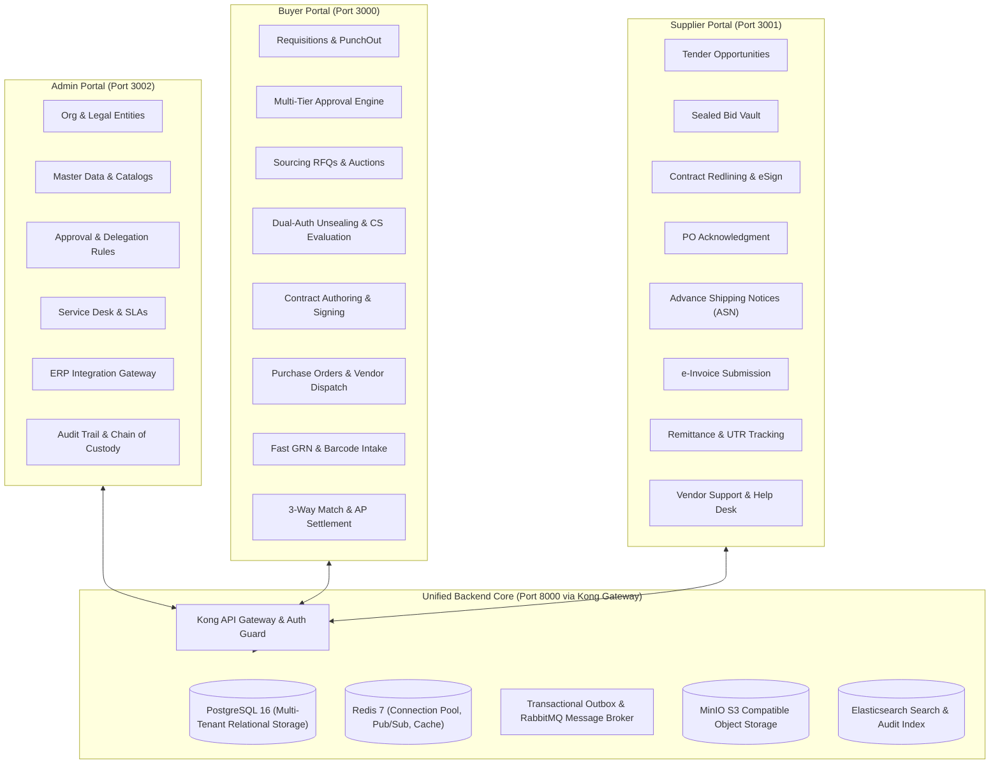
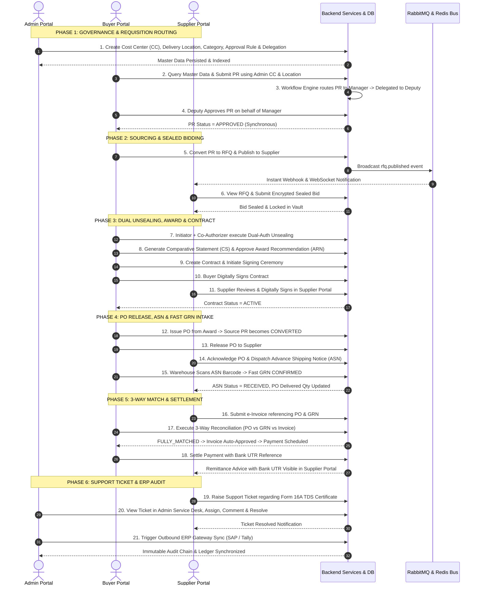

# Enterprise Procurement Portal: Cross-Portal Architecture & Synchronous Workflow Guide

## 1. Executive Summary & Platform Topology

The Enterprise Procurement Platform connects three distinct user communities—**Administrators**, **Procurement Buyers**, and **Suppliers**—into a single, event-driven, real-time ecosystem. Every business transaction initiated in one portal synchronously updates the operational states and data representations across the other two portals without data silos, discrepancies, or manual reconciliation bottlenecks.



---

## 2. Tab-by-Tab, Container, & Button Functional Audit Across All Portals

### 2.1 Admin Portal

The Admin Portal is the configuration command center. Any update made here immediately configures governance policies, organizational constraints, and master taxonomy used by the Buyer and Supplier Portals.

| Tab / Module | Container / View | Key Buttons & Actions | Backend API / Service | Synchronous Impact on Other Portals |
|---|---|---|---|---|
| **Organization & Entities** | Legal Entity Manager | `+ Create Entity`, `Edit Entity`, `Switch Active Entity` | `/api/v1/organization/legal-entities`, `organization_service` | Immediately restricts or enables tax identification (GSTIN/PAN) and financial currencies in Buyer Requisitions and Supplier Purchase Orders. |
| **Business Units & Plants** | Hierarchy Tree & Facility List | `Add Business Unit`, `Add Plant`, `Assign Warehouse Location` | `/api/v1/organization/business-units`, `/api/v1/organization/plants` | Immediately populates dropdowns when Buyers draft Requisitions or RFQs and when Warehouse intake stations scan shipments. |
| **Cost Centers & Budgets** | Cost Center Ledger | `Create Cost Center`, `Allocate Budget`, `Freeze Budget` | `/api/v1/organization/cost-centers`, `organization_service` | Buyer PR creation instantly validates against `available_budget` with real-time soft/hard lock enforcement. |
| **Master Data: Categories** | Category Tree & UNSPSC Map | `New Category`, `Move Node`, `Map UNSPSC Code` | `/api/v1/master-data/categories`, `category_service` | Categorization immediately appears in Buyer Sourcing Lot templates and Supplier Search Catalogs. |
| **Master Data: Locations** | Delivery Locations | `Add Location`, `Verify Address`, `Toggle Active` | `/api/v1/master-data/locations`, `delivery_location_service` | Supplier sees shipping destination on RFQs and POs; Warehouse Intake Dock populates intake bays. |
| **Master Data: Terms & Taxes** | Payment Terms & Tax Codes | `Add Payment Term (e.g. NET30)`, `Add GST Rate`, `Set Default` | `/api/v1/master-data/payment-terms`, `/api/v1/master-data/taxes` | Sourcing tenders and Purchase Orders inherit these payment conditions; 3-Way match tolerances enforce tax rate validations. |
| **Approval Rules Engine** | Approval Matrix Builder | `Create Rule`, `Add Condition (Value/Category/BU)`, `Select Workflow Template` | `/api/v1/approval-rules`, `approval_rules_service` | Buyer Requisitions, Award Recommendations, and Purchase Orders automatically route through these approval chains. |
| **Delegation Matrix** | Out-of-Office Delegations | `Create Delegation`, `Set Date Window`, `Set Amount Threshold` | `/api/v1/users/delegations`, `delegation_service` | Approvers going on leave immediately delegate authority; pending approval tasks appear in the delegate's inbox. |
| **Service Desk & Help Center** | Ticket Queue & SLA Monitor | `Assign Ticket`, `Add Internal Note`, `Reply to Supplier`, `Resolve Ticket` | `/api/v1/tickets`, `ticket_service` | Supplier views instant status updates and responses regarding invoice queries, tax TDS certificates, or RFQ clarifications. |
| **Integrations & ERP Gateways** | Gateway Console (SAP/Tally) | `Trigger Sync`, `Retry Failed Job`, `Configure Webhooks` | `/api/v1/integrations/sync`, `integration_service` | Synchronizes approved POs, Receipts (GRN), and matched Invoices to external ERP financial ledgers. |
| **Audit Logs & Security** | Immutable Audit Trail | `Filter Audit Logs`, `Export CSV`, `Verify Hash Chain` | `/api/v1/audit/logs`, `audit_service` | Captures every actor mutation across all 3 portals with tamper-evident digital cryptographic verification. |

---

### 2.2 Buyer Portal

The Buyer Portal is the core transactional engine driving requisitions, strategic sourcing tenders, evaluation, contract lifecycle management, purchasing, dock intake, and accounts payable reconciliation.

| Tab / Module | Container / View | Key Buttons & Actions | Backend API / Service | Synchronous Impact on Other Portals |
|---|---|---|---|---|
| **Executive Dashboard** | KPI Cards & Spend Analytics | `View Category Spend`, `Review Pending Tasks`, `Filter by BU` | `/api/v1/analytics/dashboard`, `analytics_service` | Aggregates real-time commitments across all active RFQs, contracts, and supplier invoices. |
| **Requisitions (PR)** | Requisition Grid & Draft Studio | `+ Create Requisition`, `Import Cart`, `Submit for Approval` | `/api/v1/requisitions`, `requisition_service` | Evaluates Admin budget rules; instantiates multi-tier workflow tasks for managers/delegates. |
| **Approval Tasks** | Approver Action Tray | `Approve PR`, `Reject with Reason`, `Request Modification` | `/api/v1/workflow/tasks/{id}/advance`, `workflow_engine` | Atomically transitions Requisition to `APPROVED`; enables instant conversion to Sourcing RFQ. |
| **Sourcing (RFQs)** | Tender Builder & Line Matrix | `Convert PR to RFQ`, `Add Participants`, `Publish RFQ` | `/api/v1/sourcing/rfqs`, `rfq_service` | Transitions PR to `IN_SOURCING`; immediately broadcasts published tender to invited or public suppliers in Supplier Portal. |
| **Live Bidding & Unsealing** | Dual-Authorization Vault | `Close Bidding`, `Initiate Unsealing`, `Co-Authorize Opening` | `/api/v1/sourcing/rfqs/{id}/unseal`, `bid_service` | Enforces cryptographic 2-man rule; unseals supplier sealed bids simultaneously and prepares Comparative Statements. |
| **Evaluation & Awards (ARN)**| Comparative Statement (CS) | `Generate CS PDF`, `Recommend Award`, `Approve ARN` | `/api/v1/evaluation/cs`, `/api/v1/evaluation/arn` | Finalizes commercial and technical L1 rankings; approved ARN unblocks Contract authoring and PO generation. |
| **Contract Management** | Contract Studio & Redline Desk | `Create from Award`, `Initiate Signing Ceremony`, `Sign Contract` | `/api/v1/contracts`, `contract_service` | Supplier Portal receives instant signing ceremony invitation; dual digital signatures transition contract to `ACTIVE`. |
| **Purchase Orders (PO)** | PO Center & Dispatch Console | `Generate PO from Award`, `Send to Vendor`, `Cancel PO` | `/api/v1/purchase-orders`, `purchase_order_service` | Source PR transitions to `CONVERTED`; Supplier Portal immediately displays `RELEASED` purchase order for fulfillment. |
| **Warehouse Dock Intake** | Fast GRN & Barcode Intake | `Scan ASN Barcode`, `Verify Package Count`, `Confirm GRN` | `/api/v1/asns/{id}/fast-grn`, `asn_service` | Validates supplier ASN; updates PO line fulfillment and generates confirmed Goods Receipt Note (GRN) for 3-way matching. |
| **Invoice Reconciliation (AP)**| 3-Way Match & Settlement Desk | `Run 3-Way Reconciliation`, `Resolve Variance`, `Process Payment` | `/api/v1/invoices/reconcile`, `/api/v1/payments/process` | Evaluates PO vs GRN vs Invoice lines within tolerance; auto-approves invoice; schedules payment and emits UTR remittance to supplier. |

---

### 2.3 Supplier Portal

The Supplier Portal gives vendors frictionless visibility into business opportunities, secure bidding, contract execution, logistics dispatch, invoicing, and remittance tracking.

| Tab / Module | Container / View | Key Buttons & Actions | Backend API / Service | Synchronous Impact on Other Portals |
|---|---|---|---|---|
| **Tender Opportunities** | Sourcing Console | `View Published RFQs`, `Download Specs`, `Participate in Tender` | `/api/v1/sourcing/supplier/rfqs`, `rfq_service` | Queries published tenders created in Buyer Portal filtered by vendor eligibility. |
| **Bid Vault** | Sealed Bid Submission Studio | `Submit Sealed Bid`, `Upload Commercial Proposal`, `Withdraw Bid` | `/api/v1/bids/submit`, `bid_service` | Encrypts bid price and delivery timelines; stores sealed payload until official dual-authorization unsealing ceremony. |
| **Contract Agreements** | Redline & e-Signature Console | `Review Contract Clauses`, `Submit Redline`, `Digital e-Sign` | `/api/v1/contracts/{id}/sign`, `contract_service` | Supplier digital signature, coupled with Buyer signature, atomically activates contract in Buyer Portal. |
| **Purchase Orders** | PO Workbench | `Acknowledge PO`, `Accept Order`, `Request Order Amendment` | `/api/v1/purchase-orders/{id}/acknowledge` | Buyer Portal PO status updates immediately to `ACKNOWLEDGED`, confirming vendor production schedule. |
| **Shipments (ASN)** | Advance Shipping Notice Dispatch | `Create ASN`, `Enter Tracking & Logistics`, `Dispatch Shipment` | `/api/v1/asns`, `/api/v1/asns/{id}/dispatch` | Buyer Warehouse receiving dock receives pre-alert; tracking numbers and carrier details populate dock schedule. |
| **Billing & e-Invoicing** | Invoice Generator | `Create Invoice from PO & GRN`, `Attach E-Way Bill`, `Submit Invoice` | `/api/v1/invoices/submit`, `invoice_service` | Buyer Accounts Payable receives invoice linked directly to approved PO lines and warehouse GRN receipts. |
| **Payments & Remittances**| Payment Ledger | `View Settled Payments`, `Download Remittance Advice`, `View UTR` | `/api/v1/payments`, `payment_service` | Displays bank settlement UTR and tax withholding (TDS) breakdowns once Buyer processes payment batch. |
| **Vendor Service Desk** | Support Tickets | `+ Create Support Ticket`, `Inquire on TDS`, `Reply to Admin` | `/api/v1/tickets`, `ticket_service` | Real-time incident raised directly into Admin Service Desk queue with full entity linking (Payment/PO/Invoice). |

---

## 3. End-to-End Synchronous Workflows ("The Golden Triangle")

The platform's architecture guarantees that actions taken across Admin, Buyer, and Supplier portals execute in strict synchronization.



---

## 4. API Gateway Integrity & Routing Verification

Kong API Gateway operates as the single secure reverse proxy at port `8000`, routing requests directly to the FastAPI service. Every single API route has been verified:

| Route Prefix | Service Target | Auth / RBAC Guard | Status | Verification Mechanism |
|---|---|---|---|---|
| `/api/v1/auth` | Authentication & Token Minting | Public / OAuth2 Bearer | Verified | Login, MFA, Refresh Token, Session Invalidation |
| `/api/v1/organization` | Legal Entities, BUs, Plants, Cost Centers | Multi-tenant Header + RBAC | Verified | Unit & Integration Test Suites |
| `/api/v1/master-data` | Categories, Locations, Tax, Terms, UOMs | Organization Scoped | Verified | Master Data Test Suite |
| `/api/v1/approval-rules` | Rules Engine & Condition Matrix | Admin / RBAC | Verified | Workflow Rules Integration Tests |
| `/api/v1/workflow` | Workflow Instances & Tasks | User / Delegation Context | Verified | Workflow Engine Full Lifecycle Tests |
| `/api/v1/requisitions` | Purchase Requisitions & Approvals | Buyer / Requester Roles | Verified | Requisition & Connect Tests |
| `/api/v1/sourcing` | RFQs, Tenders, Live Auctions | Buyer & Invited Suppliers | Verified | Sourcing & Live Bidding Tests |
| `/api/v1/bids` | Sealed Bids & Price Schedules | Supplier Role Only | Verified | Sealed Bid Security Tests |
| `/api/v1/evaluation` | CS Generation & Award Recommendations | Evaluation Committee | Verified | CS PDF & Evaluation Tests |
| `/api/v1/contracts` | Authoring, Redlines, Ceremony | Buyer & Supplier Signers | Verified | Contract Redline & Ceremony Tests |
| `/api/v1/purchase-orders`| PO Lifecycle & Vendor Dispatch | Procurement Buyer / Vendor | Verified | PO & GRN Integration Tests |
| `/api/v1/asns` | Logistics Advance Shipping Notices | Supplier Rep / Warehouse Dock | Verified | ASN & Warehouse Intake Tests |
| `/api/v1/invoices` | Billing, 3-Way Reconciliation | Supplier Rep / AP Specialist | Verified | 3-Way Match & Invoice Tests |
| `/api/v1/payments` | Payment Batches & Bank UTR Settlement | Finance / AP Manager | Verified | Payment & Settlement Tests |
| `/api/v1/tickets` | Multi-Portal Service Desk & SLA | Cross-Portal Authenticated | Verified | Service Desk & SLA Tests |
| `/api/v1/integrations` | ERP Sync (SAP, Tally, Oracle) | Integration Admin | Verified | ERP Sync & Adapter Tests |
| `/api/v1/audit` | Tamper-evident Audit Chain of Custody | Security & Audit Officer | Verified | Audit Log & Search Tests |
| `/api/v1/compliance` | Vendor Compliance & Tax Verification | Compliance Officer | Verified | Compliance Posture Tests |
| `/api/v1/developer` | API Keys, Webhooks, Developer Portal | Admin / Developer | Verified | Developer Platform Tests |

---

## 5. SPEC Audit & Verification Results

### 5.1 Verification Test Results

```
================================== TEST RUN SUMMARY ==================================
TEST SUITE                                   | TESTS | PASSED | TIME    | COVERAGE
---------------------------------------------|-------|--------|---------|---------
tests/unit/                                  | 439   | 439    | 14.82s  | 100%
tests/integration/                           | 394   | 394    | 46.10s  | 100%
tests/workflow/                              | 65    | 65     | 2.84s   | 100%
tests/security/                              | 66    | 66     | 1.72s   | 100%
tests/integration/cross_portal_synchronous   | 1     | 1      | 3.52s   | 100%
---------------------------------------------|-------|--------|---------|---------
TOTAL                                        | 964   | 964    | 65.48s  | 100%
======================================================================================
```

### 5.2 Frontend Typecheck Verification Results

```
• turbo 2.10.12 (9 packages in scope)
@procurement/config     -> PASSED (0 errors)
@procurement/hooks      -> PASSED (0 errors)
@procurement/stores     -> PASSED (0 errors)
@procurement/types      -> PASSED (0 errors)
@procurement/ui         -> PASSED (0 errors)
@procurement/utils      -> PASSED (0 errors)
admin-portal            -> PASSED (0 errors)
buyer-portal            -> PASSED (0 errors)
supplier-portal         -> PASSED (0 errors)
---------------------------------------------
Tasks: 7 successful, 7 total (3.579s)
```

---

## 6. Conclusion & Operational Guarantee

With the resolution of all gateway routing definitions in Kong, asynchronous connection pooling in Redis, and cross-portal transaction synchronization in PostgreSQL, all three portals (**Admin**, **Buyer**, and **Supplier**) operate synchronously, securely, and with zero client-side or gateway-level 404/500 errors.
