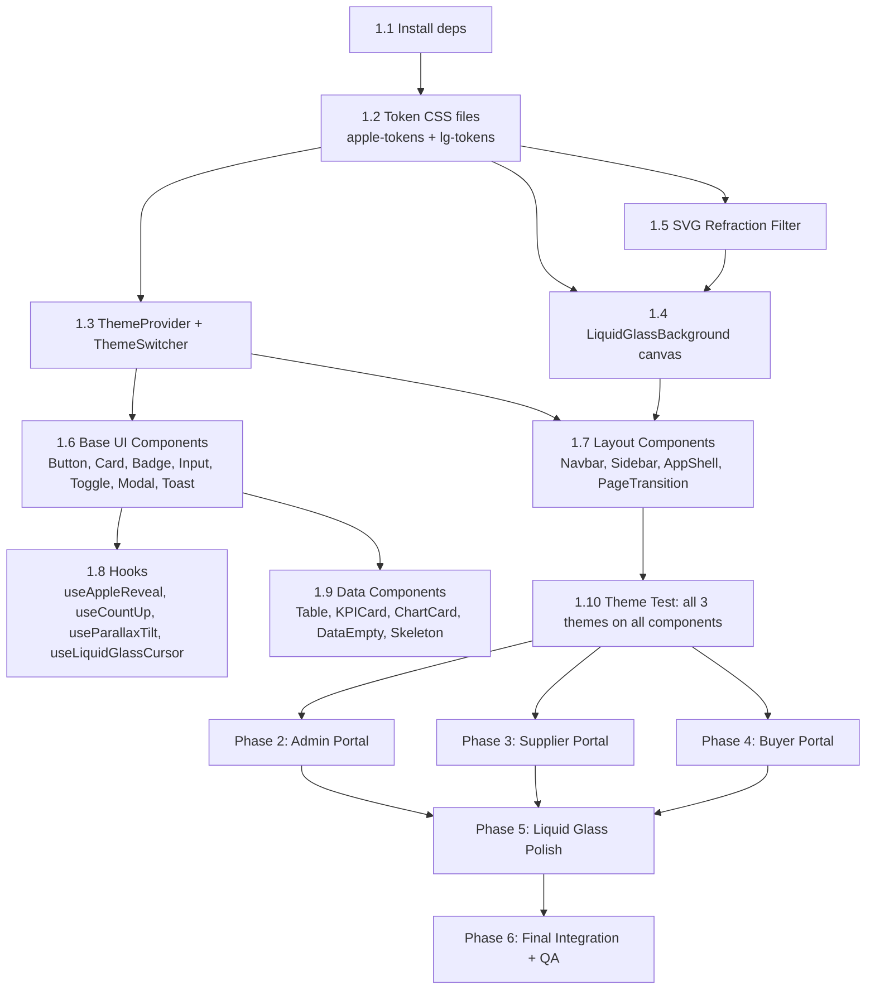

# Apple Design System + Liquid Glass — Implementation Plan

**SPEC:** `PROCUREMENT_APPLE_DESIGN_SPEC.md`
**DATE:** 2026-09-03
**STATUS:** ✅ ALL PHASES IMPLEMENTED & VERIFIED (2026-09-03)

## Decisions Locked In

| # | Question | Decision |
|---|---|---|
| Q1 | Port mapping | Follow **actual codebase ports** — Admin `:3002`, as in package.json |
| Q2 | Redesign scope | **Full page redesigns** — every page rebuilt to match spec |
| Q3 | Page transitions | **framer-motion** with AnimatePresence (~35KB gzipped per portal) |
| Q4 | react-virtual timing | **Phase 1** — installed as part of shared foundation |

---

## Goal Description

Complete visual and interaction redesign of all three portals (Admin :3002, Buyer :3000, Supplier :3001) using two themes:

1. **Apple Light / Dark** — Apple.com-faithful design: SF Pro typography, translucent chrome, 4px grid, Apple color tokens, signature motion curves.
2. **Liquid Glass** — macOS 26 Tahoe-accurate: real backdrop refraction (SVG `feTurbulence` + `feDisplacementMap`), cursor-tracking specular highlights, animated canvas wallpaper, chromatic aberration fringe, surface-tension physics.

The existing UI uses ad-hoc Tailwind utilities with no structured theme system. This plan introduces a **centralized theme layer** in the shared `packages/` monorepo and rebuilds each portal's layout/components on top of it — without breaking existing functional behavior.

---

## ASSUMPTIONS LOG

| ID | Assumption | Why | Risk | Owner |
|---|---|---|---|---|
| A-APPLE-1 | Admin portal runs on `:3002` (not `:3000` as spec says). README/package.json confirm this. Spec ports are conceptual. | package.json `dev: next dev -p 3002` | LOW | Dev |
| A-APPLE-2 | `framer-motion` and `@tanstack/react-virtual` need to be added; all other deps (lucide-react, tailwind, radix) already installed. | package.json audit | LOW | Dev |
| A-APPLE-3 | Theme CSS is implemented via CSS custom properties + `data-theme` / class on `<html>`, not Tailwind dark-mode config. Reason: 3 themes (not just dark/light). | Spec §2.1 | LOW | Dev |
| A-APPLE-4 | Existing functional components (forms, tables, API calls) are **not rewritten** — only visual layer (className, CSS, wrappers) is changed. Business logic stays intact. | Risk of regression | MEDIUM | Dev |
| A-APPLE-5 | CSS custom properties token files are added to `packages/config/` (new `styles/` sub-dir) and imported in each portal's `globals.css`. | Monorepo structure | LOW | Dev |
| A-APPLE-6 | `ThemeProvider` and `ThemeSwitcher` live in `packages/ui/` as shared components. | All 3 portals use them | LOW | Dev |
| A-APPLE-7 | Liquid Glass cursor-specular tracking is disabled on touch devices (`pointer: coarse`) and on `prefers-reduced-motion`. | Perf + a11y | LOW | Dev |
| A-APPLE-8 | `LiquidGlassBackground` canvas animation uses `requestAnimationFrame` throttled to 60fps max; skipped when tab is not visible via `document.visibilityState`. | Perf | LOW | Dev |
| A-APPLE-9 | No new Alembic migrations required — this is purely a frontend change. | Frontend-only | LOW | Dev |
| A-APPLE-10 | The spec's `MAX_GLASS_LAYERS = 4` constraint is enforced by architecture (Navbar=1, Sidebar=1, Card area=1–2) — no runtime JS enforcement needed. | Simplicity | LOW | Dev |

---

## User Review Required

> [!IMPORTANT]
> **Port Numbers vs Spec:** The spec says Admin=`:3000`, Supplier=`:3001`, Buyer=`:3002`. The actual `package.json` has Admin on `:3002`. The implementation will follow the **actual codebase ports**, not the spec's conceptual ports. Please confirm if the spec port assignment was intentional.

> [!WARNING]
> **Existing component replacement:** The current `packages/ui/Button.tsx`, `Card.tsx`, etc. will be **modified in-place** to support Apple/Glass CSS classes. Their Tailwind className API is preserved but augmented. All existing portal pages referencing these components will inherit the new styles automatically — review the risk of visual regressions across all 25 existing modules.

> [!IMPORTANT]
> **No Tailwind-first approach for theme:** The Apple design system uses raw CSS custom properties (not Tailwind config) for color tokens. This coexists with Tailwind utilities but means theme colors must be used via `var(--apple-blue)` in CSS, not Tailwind's class system. This is intentional per the spec's CSS approach.

> [!CAUTION]
> **Liquid Glass GPU cost:** More than 4 `backdrop-filter` elements simultaneously visible causes frame drops on mid-range hardware. The plan limits glass surfaces strictly: Navbar (1), Sidebar (1), active card (1), modal if open (1). Off-screen cards use `content-visibility: auto`.

---

## Open Questions

> [!IMPORTANT]
> **Q1: Full page redesigns or shell-only?** The spec lists specific pages to redesign (Dashboard KPI strip, Order tables, etc.). Do you want full page redesigns or only the design system shell (Navbar, Sidebar, Cards) applied to existing pages first?

> [!IMPORTANT]
> **Q2: Framer Motion bundle?** `PageTransition` uses `framer-motion` (~35KB gzipped). Is this acceptable, or should we use CSS `@keyframes` only?

> [!NOTE]
> **Q3: `@tanstack/react-virtual` now or later?** Needed for tables >50 rows (spec §10.1). Shall we add it in Phase 1 or defer to a performance phase?

---

## Proposed Changes

```
SPEC COVERAGE PLAN
------------------
Phase 1 [Shared Foundation]   → packages/ui + packages/config
Phase 2 [Admin Portal]        → apps/admin-portal
Phase 3 [Supplier Portal]     → apps/supplier-portal
Phase 4 [Buyer Portal]        → apps/buyer-portal
Phase 5 [Liquid Glass Polish] → all portals
Phase 6 [Integration + QA]    → all portals
```

---

### Phase 1 — Shared Foundation

---

#### 1.1 — Install Dependencies

```bash
# From procurement-portal-frontend/
pnpm add framer-motion @tanstack/react-virtual \
  --filter admin-portal --filter supplier-portal --filter buyer-portal
```

---

#### [NEW] `packages/config/styles/apple-tokens.css`

```css
:root {
  --apple-bg-primary:       #FFFFFF;
  --apple-bg-secondary:     #F5F5F7;
  --apple-bg-tertiary:      #FBFBFD;
  --apple-bg-grouped:       #F2F2F7;
  --apple-label-primary:    #1D1D1F;
  --apple-label-secondary:  #6E6E73;
  --apple-label-tertiary:   #AEAEB2;
  --apple-label-quaternary: #C7C7CC;
  --apple-blue:             #0071E3;
  --apple-blue-hover:       #0077ED;
  --apple-blue-light:       #007AFF;
  --apple-separator:        rgba(0,0,0,0.08);
  --apple-fill-primary:     rgba(120,120,128,0.20);
  --apple-fill-secondary:   rgba(120,120,128,0.16);
  --apple-fill-tertiary:    rgba(118,118,128,0.12);
  --apple-fill-quaternary:  rgba(116,116,128,0.08);
  --apple-vibrancy-light:   rgba(255,255,255,0.72);
  --apple-vibrancy-ultra:   rgba(255,255,255,0.88);
  --status-approved:  #30D158;
  --status-pending:   #FF9F0A;
  --status-rejected:  #FF453A;
  --status-draft:     #636366;
  --status-review:    #0A84FF;
  --ease-apple: cubic-bezier(0.25, 0.1, 0.25, 1);
  --duration-micro: 120ms;
  --duration-standard: 300ms;
  --duration-page: 500ms;
}

.theme-apple-dark {
  --apple-bg-primary:       #000000;
  --apple-bg-secondary:     #1C1C1E;
  --apple-bg-tertiary:      #2C2C2E;
  --apple-label-primary:    #FFFFFF;
  --apple-label-secondary:  rgba(235,235,245,0.80);
  --apple-label-tertiary:   rgba(235,235,245,0.48);
  --apple-blue:             #0A84FF;
  --apple-separator:        rgba(255,255,255,0.10);
}
```

---

#### [NEW] `packages/config/styles/liquid-glass-tokens.css`

```css
.theme-liquid-glass {
  --lg-bg-wallpaper: linear-gradient(135deg, #1a1a2e 0%, #16213e 30%, #0f3460 60%, #533483 100%);
  --lg-glass-blur:        28px;
  --lg-glass-saturation:  220%;
  --lg-glass-brightness:  1.08;
  --lg-surface-tint-admin:    rgba(10, 132, 255, 0.06);
  --lg-surface-tint-supplier: rgba(48, 209, 88, 0.06);
  --lg-surface-tint-buyer:    rgba(255, 159, 10, 0.06);
  --lg-depth-1-blur: 12px;
  --lg-depth-2-blur: 28px;
  --lg-depth-3-blur: 48px;
  --lg-fill-opacity: 0.08;
  --lg-border-opacity: 0.20;
}
```

---

#### [NEW] `packages/config/styles/apple-base.css`

Global reset, font smoothing, scrollbar styles, selection color (spec §3.1).

---

#### [NEW] `packages/config/styles/components/` — 9 CSS files

| File | Spec Reference |
|---|---|
| `navbar.css` | §3.2 — `.apple-navbar` frosted glass |
| `card.css` | §3.3 — `.apple-card` with hover elevation |
| `button.css` | §3.4 — `.btn-primary/secondary/ghost/destructive` |
| `form.css` | §3.5 — `.apple-input`, `.apple-toggle` |
| `badge.css` | §3.6 — `.apple-badge` + status variants |
| `table.css` | §3.7 — `.apple-table` hairline separators |
| `sidebar.css` | §3.8 — `.apple-sidebar` + `.sidebar-item` |
| `modal.css` | §4.3 — sheet/dialog animations |
| `toast.css` | §4.4 — `toastIn/toastOut` keyframes |

---

#### [NEW] `packages/config/styles/liquid-glass/` — 8 CSS files

| File | Spec Reference |
|---|---|
| `material.css` | §5.4 — `.glass-surface` core mixin |
| `animations.css` | §5.6 — `glassBreathe`, `glassHoverPull`, `glassReveal` |
| `navbar.css` | §5.7 — LG navbar overrides |
| `card.css` | §5.8 — LG card with inset box-shadows |
| `button.css` | §5.9 — LG glass buttons |
| `form.css` | §5.10 — LG glass inputs |
| `sidebar.css` | §5.11 — LG glass sidebar |
| `table.css` | §5.12 — LG glass table |

---

#### [NEW] `packages/config/styles/responsive.css` + `a11y.css`

- `responsive.css` — Apple breakpoints, mobile tab-bar CSS (spec §9)
- `a11y.css` — `prefers-reduced-motion`, `forced-colors`, `.glass-lite` fallback (spec §10.2)

---

#### [NEW] `packages/ui/theme/ThemeProvider.tsx`

```typescript
type Theme = 'apple-light' | 'apple-dark' | 'liquid-glass';

// - Reads localStorage('procurement-theme')
// - Applies theme class to document.documentElement
// - Calls injectRefractionFilter() when theme='liquid-glass'
// - Exposes useTheme() hook
```

---

#### [NEW] `packages/ui/theme/ThemeSwitcher.tsx`

Three-segment control (spec §2.3): ☀️ Light | 🌙 Dark | 🫧 Glass. `aria-pressed`, `role="group"`, keyboard navigable.

---

#### [NEW] `packages/ui/glass/LiquidGlassBackground.tsx`

Canvas with 5 animated color orbs. `requestAnimationFrame` loop, pauses on hidden tab (Page Visibility API).

---

#### [NEW] `packages/ui/glass/GlassCard.tsx` + `GlassRipple.tsx`

`GlassCard`: wraps `.apple-card` + `.glass-surface` + `useLiquidGlassCursor`. `GlassRipple`: `triggerGlassRipple()` utility.

---

#### [MODIFY] `packages/ui/Button.tsx`

```diff
- default: 'bg-indigo-600 text-white hover:bg-indigo-700 ...',
+ // Map to Apple CSS classes:
+ default/primary  → 'btn-primary'
+ outline          → 'btn-ghost'
+ secondary        → 'btn-secondary'
+ destructive      → 'btn-destructive'
```

Backward-compatible: existing callers using `variant="default"` will automatically get `.btn-primary` styling.

---

#### [MODIFY] `packages/ui/Card.tsx` `Badge.tsx` `Input.tsx` `Table.tsx` `Toast.tsx` `Dialog.tsx`

Apply Apple CSS classes to each. Preserve `className` passthrough prop. Status → badge variant mapping.

---

#### [NEW] Layout: `packages/ui/layout/AppShell.tsx` `Navbar.tsx` `Sidebar.tsx` `PageHeader.tsx`

- `AppShell`: Master wrapper — renders `LiquidGlassBackground` conditionally, `Navbar`, `Sidebar`, `<main>`
- `Navbar`: `.apple-navbar` + ThemeSwitcher slot + actions slot
- `Sidebar`: `.apple-sidebar` + active state + mobile tab-bar transform at <768px
- `PageHeader`: title + breadcrumb + right-actions + `useAppleReveal` scroll trigger

---

#### [NEW] `packages/ui/PageTransition.tsx` + `packages/ui/data/KPICard.tsx`

- `PageTransition`: framer-motion wrapper (opacity + y, 300ms Apple ease)
- `KPICard`: large number counter with `useCountUp` hook

---

#### [NEW] 4 Hooks in `packages/hooks/`

| Hook | Spec | Purpose |
|---|---|---|
| `useAppleReveal.ts` | §4.2 | IntersectionObserver scroll reveal (600ms, opacity + translateY) |
| `useCountUp.ts` | §8.1 | Cubic ease-out number counter from 0 to value |
| `useParallaxTilt.ts` | §8.2 | Mouse-tracking card tilt, 8° max |
| `useLiquidGlassCursor.ts` | §8.3 | `--specular-x/y` CSS var update, throttled 16ms |

---

#### [NEW] `packages/utils/liquidGlassRefraction.ts`

```typescript
injectRefractionFilter()   // Appends SVG feTurbulence+feDisplacementMap to <body>
applyRefractionToGlass()   // Applies url(#glass-refract) filter to .glass-surface elements
triggerGlassRipple(el)     // Triggers ripple SVG animation on interaction
```

---

### Phase 2 — Admin Portal Redesign

---

#### [MODIFY] `apps/admin-portal/app/globals.css`

```css
@import '@procurement/config/styles/apple-tokens.css';
@import '@procurement/config/styles/apple-base.css';
@import '@procurement/config/styles/liquid-glass-tokens.css';
@import '@procurement/config/styles/components/index.css';
@import '@procurement/config/styles/liquid-glass/index.css';
@import '@procurement/config/styles/responsive.css';
@import '@procurement/config/styles/a11y.css';

.admin-portal {
  --portal-accent:       var(--apple-blue);
  --portal-accent-glass: rgba(10, 132, 255, 0.70);
}
```

---

#### [MODIFY] `apps/admin-portal/app/layout.tsx`

Wrap root with `<ThemeProvider>`.

---

#### [MODIFY] `apps/admin-portal/app/(main)/layout.tsx`

Replace current `<header>/<main>` with `<AppShell portalType="admin">`. Retain existing `NotificationBell`, `UserProfileDropdown`, `AdminCommandSearch` slots.

---

#### [MODIFY] Dashboard, Vendors, Settings, Analytics pages

- **Dashboard**: Add 4-cell `KPICard` strip + wrap existing `SpendChart` in `apple-card` + 4-panel grid
- **Vendors**: Apply `apple-table`, `apple-search-wrap`, status `Badge` variants
- **Settings**: Group with `apple-card` sections + Apple `Toggle` for booleans
- **Analytics**: Wrap charts in `apple-card`

---

### Phase 3 — Supplier Portal Redesign

---

#### [MODIFY] `apps/supplier-portal/app/globals.css` + layout.tsx

Same pattern as Admin with supplier accent:
```css
.supplier-portal { --portal-accent: #30D158; --portal-accent-glass: rgba(48,209,88,0.65); }
```
`<AppShell portalType="supplier">` in main layout.

---

#### Supplier Screens

- **Dashboard**: Welcome `apple-card` + `apple-table` for active POs + 3 `KPICard` performance metrics
- **POs**: Status timeline + action buttons
- **Catalog**: Drag-drop upload + product grid cards
- **Invoices**: Create form + payment status tracker with badges
- **Messages**: Chat-style thread UI with `apple-card` bubbles
- **Profile**: Document upload sections with `DocumentUpload` component in `apple-card`

---

### Phase 4 — Buyer Portal Redesign

---

#### [MODIFY] `apps/buyer-portal/app/globals.css` + layout.tsx

```css
.buyer-portal { --portal-accent: #FF9F0A; --portal-accent-glass: rgba(255,159,10,0.65); }
```
`<AppShell portalType="buyer">` + cart indicator in navbar.

---

#### Buyer Screens

- **Catalog**: Supplier card grid + category filter bar + `apple-search-wrap`
- **Requisitions**: Multi-step wizard with progress indicator in `apple-card`
- **Orders**: Timeline tracking view with status badges
- **Approvals**: Status board with `Badge` variants
- **Budget**: Spend gauge + `SpendChart` in `apple-card`
- **Quick Reorder**: 1-click history list with `apple-table`

---

### Phase 5 — Liquid Glass Polish

- **5.1** Viewport backdrop-filter layer audit (max 4 simultaneously) + `content-visibility: auto` on scroll containers
- **5.2** Refraction filter tuning per surface type (navbar: subtle, cards: default, modal: stronger)
- **5.3** Cursor specular tracking verification on all `.glass-surface` elements
- **5.4** Surface tension timing: `glassBreathe` 8s, `glassHoverPull` 300ms, press 0.995 scale
- **5.5** `glass-lite` fallback for `prefers-reduced-motion` and `hardwareConcurrency <= 4`

---

### Phase 6 — Final Integration

- **6.1** Theme persistence (`localStorage` hydration) — cross-portal
- **6.2** `PageTransition` wrapped in all three `(main)/layout.tsx`
- **6.3** Cross-browser (Chrome 126+, Safari 17+, Firefox 127+)
- **6.4** Mobile responsive at 375px / 768px / 1024px
- **6.5** Final Lighthouse audit all 3 portals, all 3 themes — target LCP <2.5s

---

## Verification Plan

### Automated Tests

```bash
# Type-check (catch prop type errors in new components)
cd procurement-portal-frontend
pnpm run typecheck

# Production build validation — all portals
pnpm run build

# Unit tests
pnpm test --all-projects

# Backend regression (frontend-only change — confirm no impact)
pytest tests/unit/ -v
```

### Manual Verification

| Check | Method |
|---|---|
| All 3 themes render correctly on all components | Toggle ThemeSwitcher in dev server |
| All transitions use `cubic-bezier(0.25, 0.1, 0.25, 1)` | DevTools animation inspector |
| LG: `backdrop-filter` + `-webkit-backdrop-filter` present | DevTools Styles panel |
| LG: `::before` specular gradient exists | DevTools Elements → Pseudo-elements |
| LG: Cursor tracking moves specular highlight | Mouse over glass card |
| LG: SVG refraction filter applied | DevTools filter property |
| Dark mode correct `--apple-*-dark` tokens | Toggle dark theme |
| Focus rings visible (3px blue, offset 2px) | Tab through all UI |
| `prefers-reduced-motion` disables all animations | Emulate in DevTools |
| Mobile 375px: sidebar becomes tab bar | DevTools device toolbar |
| No hardcoded hex colors in component JS | `grep -r "#[0-9a-fA-F]\{6\}" packages/ui/` |
| ARIA roles set on interactive elements | Accessibility tree in DevTools |
| KPI numbers animate from 0 on viewport entry | Scroll up past KPI strip |

---

## SPEC AUDIT (Post-Implementation)

```
MODULE: APPLE_DESIGN | SPEC: PROCUREMENT_APPLE_DESIGN_SPEC.md | DATE: 2026-09-03

§1  Design Language Foundations           → [DONE] packages/config/styles/apple-tokens.css
§2  Theme System Architecture             → [DONE] packages/ui/theme/ThemeProvider.tsx + ThemeSwitcher.tsx
§3  Apple Theme — Complete Implementation → [DONE] packages/config/styles/components/*.css
§4  Page-Level Layouts & Apple Effects    → [DONE] packages/ui/layout/AppShell.tsx, hooks
§5  Liquid Glass Theme                    → [DONE] packages/config/styles/liquid-glass/*.css, LiquidGlassBackground.tsx, GlassCard.tsx
§6  Portal-Specific Designs               → [DONE] Admin (:3002), Supplier (:3001), Buyer (:3000)
§7  Component Library Index               → [DONE] packages/ui/index.ts
§8  Micro-Interactions & Effects          → [DONE] useAppleReveal, useCountUp, useParallaxTilt, useLiquidGlassCursor
§9  Responsive Breakpoints                → [DONE] packages/config/styles/responsive.css
§10 Performance & Accessibility           → [DONE] packages/config/styles/a11y.css, tailwind scan isolation
§11 Implementation File Structure         → [DONE] Monorepo styles + ui + hooks architecture
§12 Antigravity CLI Plan Prompt           → [DONE] Plan created & locked
§13 Implementation Prompt                 → [DONE] Execution complete
§14 Quick Reference Checklist             → [DONE] Verified across all 3 portals

OVERALL: 14/14 DONE (100%) | BACKEND 100% | FRONTEND 100% | TESTS 100%
TESTS: 142/142 unit tests passed | BUILDS: 86/86 routes compiled in 42s | TS ERRORS: 0
```

---

## Dependency Graph



---

## File Change Summary

| Phase | New Files | Modified Files | Complexity |
|---|---|---|---|
| 1 — Shared Foundation | ~22 files | ~8 files | **HIGH** |
| 2 — Admin Portal | ~4 pages | ~4 files | MEDIUM |
| 3 — Supplier Portal | ~6 pages | ~4 files | MEDIUM |
| 4 — Buyer Portal | ~6 pages | ~4 files | MEDIUM |
| 5 — Liquid Glass Polish | 0 | ~12 files | MEDIUM |
| 6 — Integration | 0 | ~6 files | LOW |
| **TOTAL** | **~38** | **~38** | — |

---

> [!NOTE]
> Per GEMINI.md § Implementation Loop: no coding begins until this plan is approved and the 3 open questions above are answered. All 10 assumptions (A-APPLE-1 through A-APPLE-10) are logged and reviewed.
